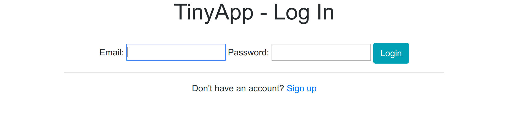
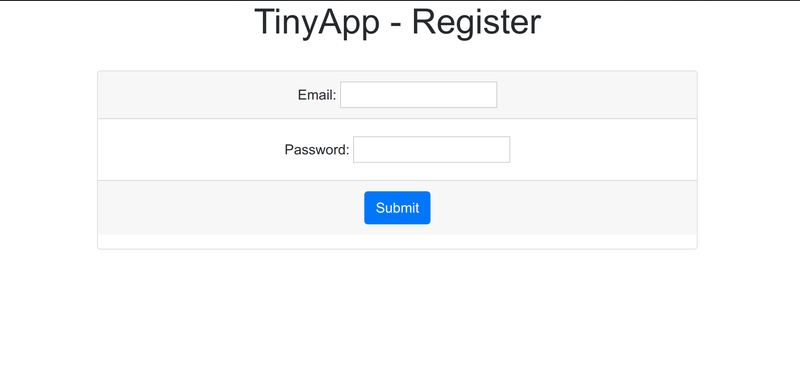
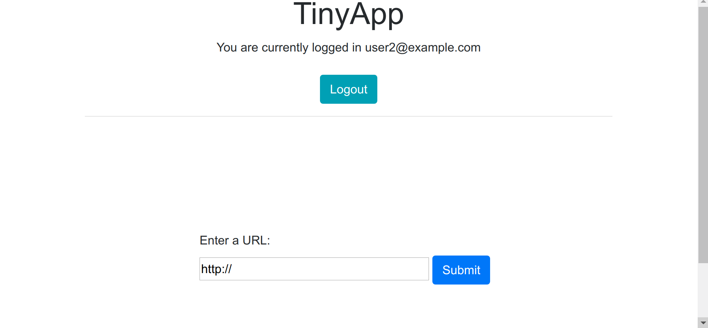
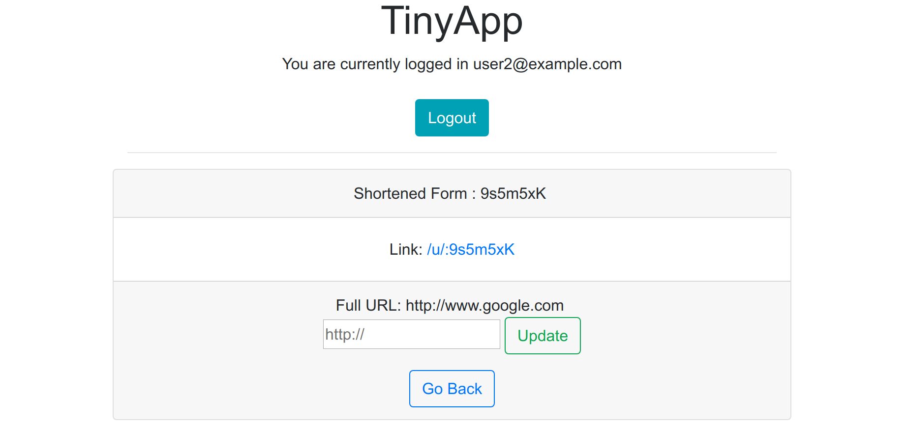
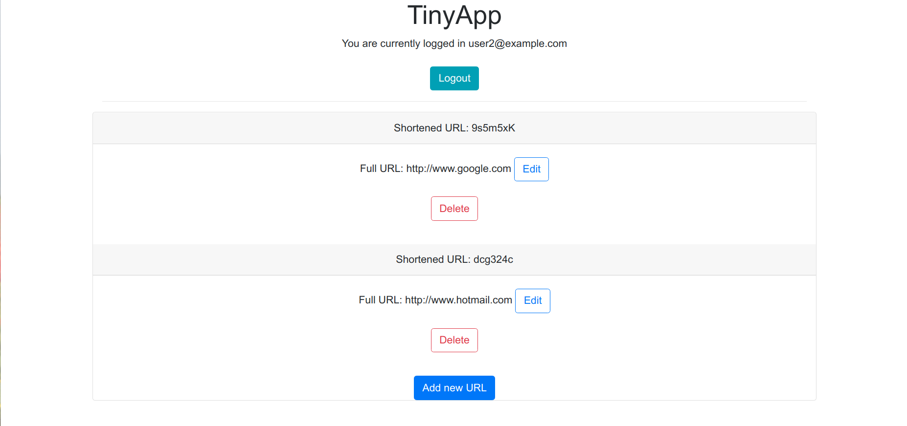

# Tiny App Project

TinyApp is a full stack web application build with Node and Express that allows users to shorten long URLs

## Final Product

### 1. Login Page

### 2. Registration Page

### 3. New URL

### 4. Edit URL

### 5. List of URLS
 

## Dependencies
- Node.js
- Express
- EJS
- bcrypt
- body-parser
- cookie-session

## Getting Started
- Install all dependencies (using the ‘npm install’ command)
- Run the development web server using the `node express_server.js` command
